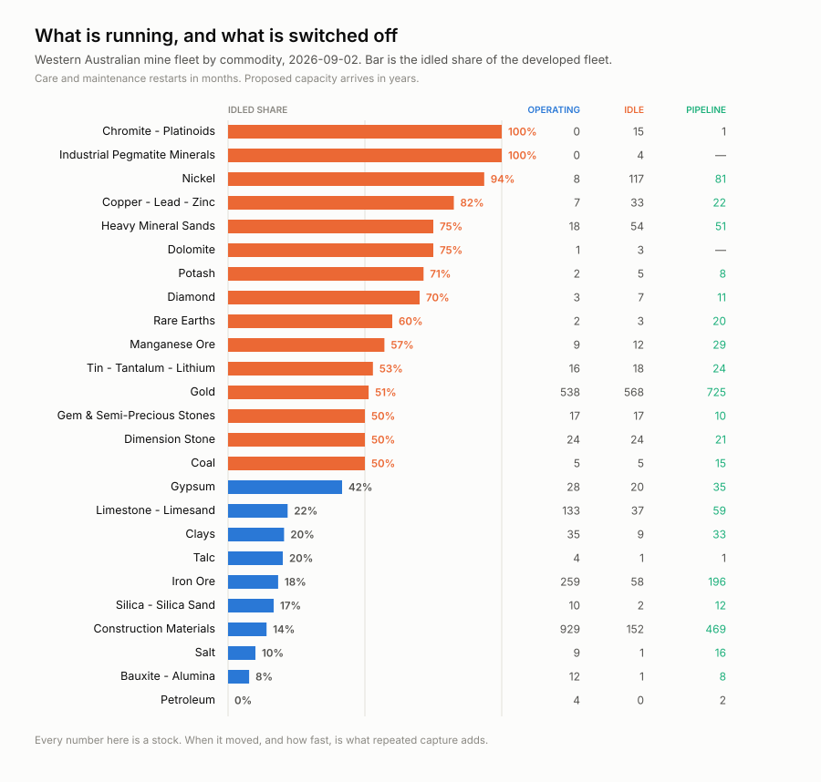
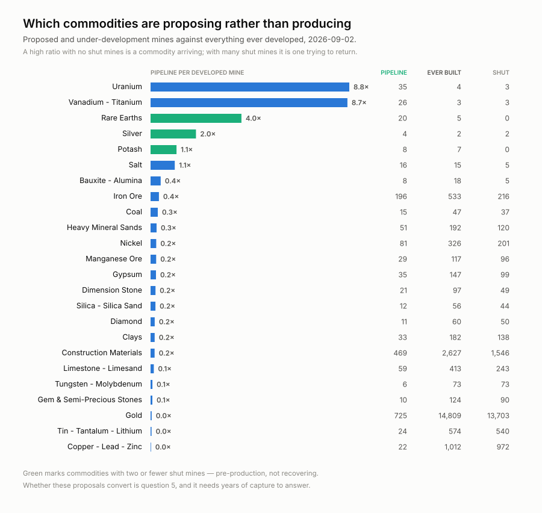
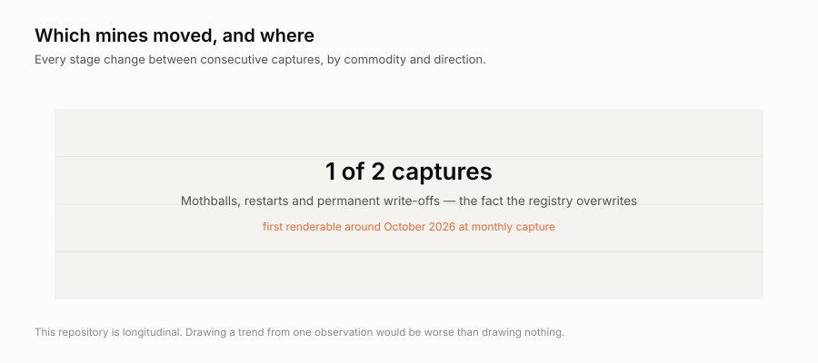

# wss-mining-pipeline

**What Western Australia's mining registry shows today, kept so you can see it change.**

The registry publishes the current state of 10,004 mine sites and 30,463 live
tenements. It has no `timeInfo`, no historic-moment support and no dated
snapshots — when a mine moves from *Operating* to *Care and Maintenance*, the
previous value is overwritten and nothing records when it happened.

That transition is the point. Idled capacity restarts in months, so knowing
**when** a commodity's fleet went dark, and how fast, is a supply signal that
the snapshot alone cannot give you.

At the first capture (2 September 2026):

| | operating | care & maintenance | proposed |
| --- | --- | --- | --- |
| **Nickel** | **1** | **45** | 19 |
| Gold | 169 | 247 | 171 |
| Iron ore | 60 | 10 | 20 |
| Rare earths | 1 | 1 | 9 |

Across the state there are 400 operating mines and 406 mothballed ones. This
repository exists to record what happens to those numbers next.

## What it looks like today



Nickel runs **one** mine against 45 mothballed. Even gold, at 169 operating,
has 247 idled. Iron ore is the healthy one at 14%.



Three commodities — uranium, vanadium-titanium and rare earths — have almost
no shut mines at all. They are arriving, not recovering. Everything else has
more closed mines than proposals.

## What it will look like later, and not before



These two render as placeholders until enough captures exist, and they say so
on their face. Both are generated by the same
[`examples/visualize.py`](examples/visualize.py) — re-run it after any capture
and the placeholders become charts on their own. A repository that invents a
trend from one observation is worse than one that draws nothing.

## Should you fork this?

**Fork it if** you want a dated record of *when* Western Australian mines
change state — for supply modelling, critical-minerals work, or as a worked
example of capturing a registry that overwrites itself.

**Do not fork it if** you need any of the following, because it will never
have them:

| you need | status |
| --- | --- |
| Why a mine was mothballed | **never** — `site_stage` carries no reason code |
| Production, employment, reserves, capex | **never** — not in MINEDEX |
| Prices, or lead/lag against them | cite a price series; this fleet does not capture prices |
| Who owns the ground | [blocked on a personal-data decision](docs/ownership-is-blocked.md) |
| Anywhere outside Western Australia | [Brazil is scoped and blocked](docs/pagination.md) |
| History before September 2026 | impossible — that is the point; nobody kept it |

**What it costs to run:** one GitHub Actions job a month, 3 polite GETs against
one government host, about **12 MB of raw archive and 36 MB of derived table
per year**. No API key, no account, no scraping — a public ArcGIS service with
an open licence.

**How honest is it?** Every claim above was measured, not assumed. Source
latency was sampled (median 1.13s over 12 requests, one 29.2s outlier that set
`timeout_seconds: 90`). Competing products were checked and are named in
[research questions](docs/research-questions.md) — S&P Global, Wood Mackenzie
and CRU all sell this, and WA publishes its own *Operating Mines* extract. The
gap is narrow: nobody publishes a free, machine-readable **time series** of
these transitions.

## The fact kept

| metric | entity | why it is here |
| --- | --- | --- |
| `stage` | `site:wa:<site_code>` | Operating / Care and Maintenance / Proposed / Under Development / Shut / Undeveloped — overwritten in place |

`commodity` and `site_type` ride alongside because a stage change is unreadable
without knowing what the site produces and whether it is a mine at all. Site
coordinates go into the raw archive but not the observation table: they exist
only to make a later spatial join to tenements possible.

Everything is long format: one row per `entity_id` × `metric` × `observed_at`.
`observed_at` is the **service's own extract stamp**, not the fetch time, so a
re-fetch of unchanged rows restates the same observation instead of inventing a
new one. Deduplicate on `(entity_id, metric, observed_at)` taking the latest
`captured_at`.

## What is deliberately not here

WA's 422,194 dead tenements back to 1883, its exploration reports, and British
Columbia's tenure registry all keep their own history — so they are cited, not
mirrored. Brazil's 269,427 active processes *should* be here and cannot be yet.

Both are written up: [what we do not capture](docs/what-we-do-not-capture.md)
and [pagination](docs/pagination.md).

**Ownership is captured by nobody here either, and that is a decision.** The
tenement source is written and paused: 40% of holders are named individuals,
and this fleet declares `personal_data: none`. See
[ownership is blocked](docs/ownership-is-blocked.md).

## What it is for

[Research questions](docs/research-questions.md) — the six questions this
archive can answer, the one it cannot answer without a price series, and the
two it can never answer (there is no reason code for a stage change, and no
production data). It also records who already sells this and what is actually
uncovered.

## Cadence, and why monthly

Care-and-maintenance decisions are board decisions measured in quarters.
Weekly capture would over-sample them and cost four times the storage for no
extra resolution. One pass is 11 polite GETs against a single WA government
host, which is also why `SHARDS: "1"` — sharding would put several runners on
one server at once, and the per-host delay is per process.

Roughly 12 MB of raw archive and 36 MB of derived table per year with the
tenement source paused. Each capture is verified by a truncation gate rather
than trusted — see [pagination](docs/pagination.md).

`derive` runs the day after and writes **what moved** into the workflow
summary, so a month with no movement is visible as a no-op rather than silence.

## How it runs

Three scheduled workflows a day — capture (22:10 UTC), health (23:40),
derive (00:20) — powered by the
[wss](https://github.com/neldivad/wss) engine, pinned to one
version. No workflow ever names a source: capture shards whatever
`registry/` marks active, so infrastructure never changes when sources do.
The bot commits **data only** — it never changes code; the one config it may
touch is flipping a repeatedly-failing source to `auto_disabled`, with an
issue explaining why.

## Adding a source

1. Add `registry/<source_id>.yml` (copy the example entry), `status: paused`.
2. Add a parser in `parsers/` if the payload shape is new.
3. `wss doctor <source_id>` — **read the raw response**.
4. Flip to `status: active`, add a Coverage row, commit.

Nothing else. No workflow edits, ever.

## Run it locally

```bash
python -m venv .venv && . .venv/bin/activate
pip install -r requirements.txt
export WSS_CONTACT="you or your repo URL"   # identifies you to publishers

wss validate
wss doctor <source_id>
wss capture --cadence monthly
wss derive --parsers parsers.<module>
wss health --dry-run

python examples/load_observations.py    # sqlite + the queries in examples/queries.sql
python examples/visualize.py            # redraw examples/charts/, placeholders included
python examples/whats_changed.py        # which mines moved since the previous capture
```

`wss derive` finds `parsers/` on its own; `--parsers` is only for parsers kept
elsewhere. `wss sources` regenerates [SOURCES.md](SOURCES.md), which links every
endpoint, its licence and its last stored capture.

## Going live

1. Push this repo **and the engine repo** under the same GitHub owner
   (`neldivad`) — the workflows install the engine from
   `github.com/neldivad/wss` at the pinned tag.
2. Set the repo secret **`WSS_CONTACT`** — capture refuses to run
   without it.
3. Run `capture-monthly` once by hand (Actions → capture-monthly → Run
   workflow), confirm the bot's data commit lands, then let the cron take
   over.

## Licences

Two separate files, on purpose: code is MIT ([LICENSE](LICENSE)); data
(`raw/`, `manifest/`, `derived/`) is CC-BY-4.0
([LICENSE-DATA](LICENSE-DATA)), citation in [CITATION.cff](CITATION.cff).
Captured content remains subject to the publisher's own terms.

Topics: `git-scraping` · `open-data` · `point-in-time-data` · `dataset`
